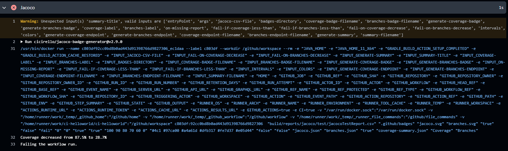
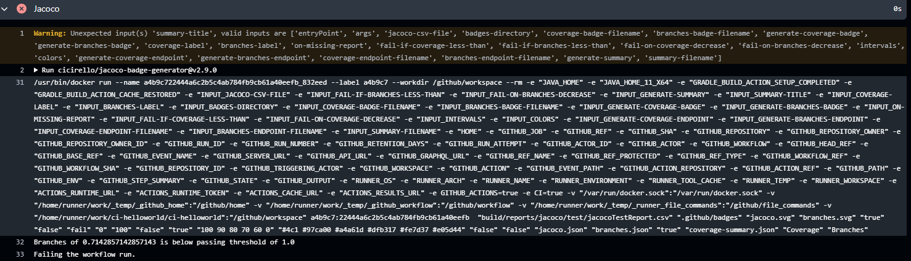

1. url to the github repo where all files are stored.

https://github.com/ZejunMa/ci-helloworld

2. url to the published (public) image on docker hub

https://hub.docker.com/r/zejunma/ci-helloworld

These are the proof image for the requirement of the pipeline here must fail if the code coverage OR branch coverage is less than the provious run of the pipeline.

