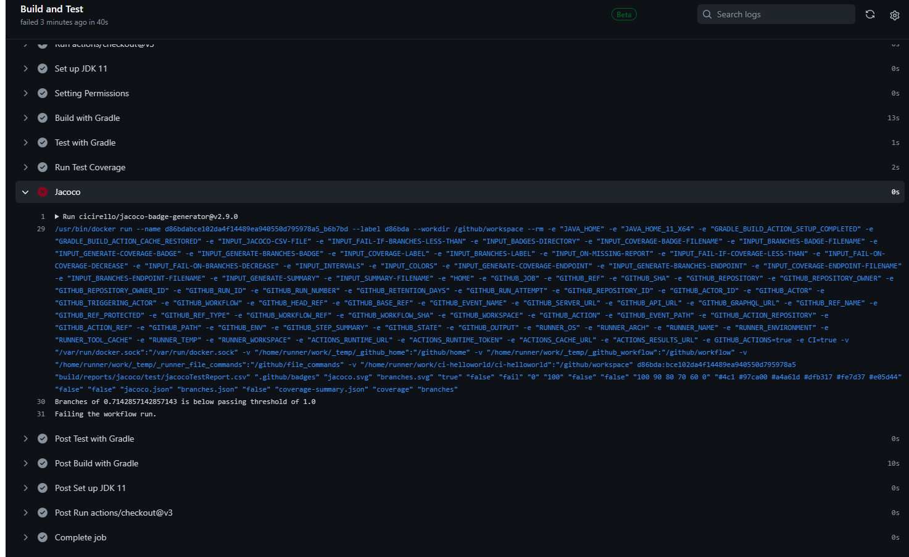

# ci-helloworld
Task4 Homework4 
## github repo url

https://github.com/ZejunMa/ci-helloworld.git

##  url to the published (public) image on docker hub
https://hub.docker.com/r/zejunma/ci-helloworld
## failure reason
The workflow fails at Jacoco, and the failure reason is shown in the snipping
